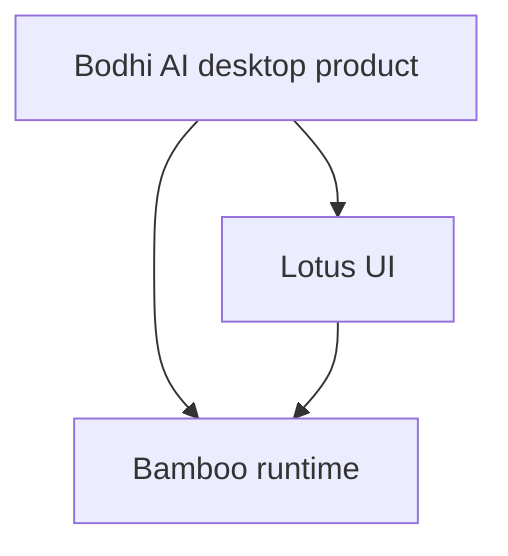

# Bodhi AI

Bodhi AI is a **desktop AI workbench** designed to help you move work forward on your own machine: plan tasks, run tools, connect MCP systems, keep long-running context alive, and turn repeated work into automation.

## The pitch

**Bodhi AI turns AI from a chat experience into a desktop work system.**

## What Bodhi AI wants to be

- Something you can install and actually use every day
- Something that shows its work instead of hiding it
- Something that can remember, adapt, and keep long tasks moving
- Something that turns success into workflows and schedules

## Why Bodhi AI feels different

### 1. It feels like an AI product, not a demo
Desktop-native experience with real surfaces for settings, providers, env vars, metrics, skills, MCP, and workflows.

### 2. It does not just answer — it advances work
Break work into steps, run tools, manage state, and keep execution moving.

### 3. The process is visible
See tasks, tools, events, status changes, and runtime behavior as the system moves.

### 4. It gets more valuable over time
A one-off useful run can become a workflow. A workflow can become a schedule.

## What's underneath

Bodhi AI is one layer in a larger system:

- `bodhi` — desktop shell and product surface
- `lotus` — React + Vite UI layer
- `bamboo` — structured Rust runtime (backend)



## Architecture Overview

Bodhi owns the desktop shell (Tauri), packaging, and native integrations. Lotus owns the frontend UI. Bamboo owns the backend runtime.

Key runtime components:
- **Agent loop**: LLM-driven tool execution with approval checkpoints
- **Tool system**: 20+ built-in tools (file ops, search, edit, shell, workspace) with registry and permission control
- **Memory system**: Session notes, Dream notebook, long-session compaction
- **Workflows & Schedules**: Saved agent behaviors that can run on demand or automatically
- **MCP integration**: Connect external Model Context Protocol servers

## Configuration

### Agent loop environment variables

| Variable | Default | Description |
|----------|---------|-------------|
| `AGENT_MAX_ITERATIONS` | `10` | Max agent loop iterations |
| `AGENT_TIMEOUT_SECS` | `300` | Total timeout (5 min) |
| `AGENT_TOOL_TIMEOUT_SECS` | `60` | Per-tool timeout |

### Build modes

Internal/public mode controls whether a startup confirmation dialog is shown. Set `VITE_INTERNAL_BUILD` in lotus `.env`:

```bash
cd lotus && npm run rebrand:internal
cd lotus && npm run rebrand:public
```

## Development

### Quick start

```bash
cd bodhi
npm install
npm run tauri:dev
```

Bodhi can source Lotus assets from either a local sibling checkout (`../lotus`) or the published npm package (`@bigduu/lotus`), controlled by `LOTUS_SOURCE=auto|local|package`.

### Standalone mode

For debugging frontend/backend independently:

```bash
# Terminal 1: Start backend
cd bamboo && cargo run -- serve --port 9562

# Terminal 2: Start frontend
cd lotus && npm run dev
```

### Useful commands

```bash
npm run tauri:build      # production build
npm run web:build        # web build
npm run type-check       # TypeScript
npm run test:run         # Vitest
npm run test:e2e         # Playwright E2E
```

## Testing

- Bamboo: 1,700+ Rust tests (`cd bamboo && cargo test --all`)
- Lotus: Vitest unit tests (`npm run test:run`) + Playwright E2E (`npm run test:e2e`)
- Bodhi: Desktop shell tests (`npm run test:run`)

## Documentation

- [Architecture overview](./docs/architecture/zenith-flow-diagram.md)
- [Agent configuration](./docs/configuration/AGENT_CONFIGURATION.md)
- [Migration guide (v0.3.0)](./docs/release/MIGRATION_v0.3.0.md)
- [Moved-to-Lotus redirect map](./docs/MOVED_TO_LOTUS.md)

## When Bodhi AI is the right choice

Choose Bodhi AI if you want:
- A **desktop AI agent product** with stronger AI product feel
- A system that **shows its work** instead of hiding execution
- Something that can evolve from one run into **workflows and schedules**
- Bamboo's runtime power in a **more usable, more compelling product surface**
