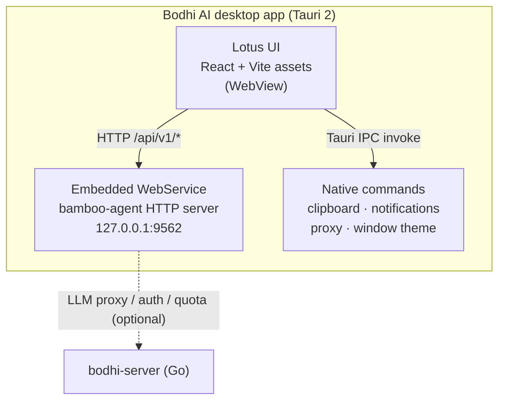

# Bodhi AI

> 桌面 AI 工作台 · The desktop AI workbench
>
> 这是 [Zenith](https://github.com/bigduu/Zenith) 单仓中的 **桌面外壳（Tauri shell）+ 产品门面** 模块。
> This module is the **desktop shell (Tauri) and product surface** within the Zenith monorepo.

---

## 1. 这是什么 / The Hook

**中文：** Bodhi AI 把 AI 从一个"聊天框"变成一台**会干活的桌面工作台**。你下达一个目标，它会把任务拆成步骤、调用工具、读写文件、连接你的工具系统，并且**把每一步都摊在你面前**——你看得见它在做什么，而不是只给你一段文字。更妙的是：一次好用的运行可以被沉淀为可复用的流程，流程又可以挂上定时计划。AI 不再是一次性的回答，而是会随时间**越用越值钱**的助手。

**English:** Bodhi AI turns AI from a chat box into a **desktop work system that actually moves work forward**. You hand it a goal; it breaks the goal into steps, runs tools, reads and writes files, connects to your systems — and **shows every step of its work** instead of just handing you a wall of text. Better still: a one-off useful run can be saved as a reusable workflow, and a workflow can be put on a schedule. AI stops being a disposable answer and becomes an assistant that **compounds in value over time**.

It installs and runs as a real desktop app (Windows / macOS / Linux), with a global hotkey, native notifications, and a local engine running inside the app — no separate server to babysit.

---

## 2. 核心能力一览 / Key Capabilities at a Glance

| 能力 / Capability | 说明 / What it does |
|---|---|
| 🖥️ 桌面原生外壳 / Native desktop shell | 真正的桌面应用窗口（Tauri 2），跨平台打包 (`bundle.targets: all`) |
| ⌨️ 全局唤起 / Global hotkey | `Cmd/Ctrl + Shift + Space` 随时显示/隐藏主窗口 |
| 🔌 内嵌引擎 / Embedded engine | 应用内直接运行 Bamboo 运行时 HTTP 服务（默认端口 `9562`），无需独立 sidecar 进程 |
| 🔔 系统通知 / Native notifications | 通过系统通知中心推送桌面提醒 |
| 📋 系统剪贴板 / Clipboard | 原生剪贴板写入（macOS / Windows） |
| 🌐 代理配置 / Proxy config | 读写 HTTP/HTTPS 代理及认证，持久化到 `config.json` |
| 🎨 主题同步 / Window theme | 跟随前端切换浅色/深色/系统主题 |
| 📦 Lotus 资产装配 / Lotus asset staging | 通过 `LOTUS_SOURCE` 在本地源码或 npm 包之间选择前端来源 |
| 🏢 内部/公开构建 / Build modes | 内部构建启动时弹出确认对话框，公开构建直接进入 |

---

## 3. 架构 / Architecture

**中文：** Bodhi 只负责"外壳"和"产品门面"：它拥有桌面窗口、原生集成（剪贴板、通知、全局快捷键、代理）、打包与发布；前端 UI 由 **Lotus** 提供；真正的执行引擎是 **Bamboo**（Rust 本地优先 agent 运行时）。关键点：Bodhi **把 Bamboo 引擎以库的形式直接编译进应用进程**（`bamboo-agent` crate 依赖），并在应用启动时拉起一个内嵌的 HTTP 服务；Lotus 前端通过 HTTP 与这个本地服务通信。

**English:** Bodhi owns only the shell and the product surface — the desktop window, native integrations (clipboard, notifications, global shortcut, proxy), packaging and release. The UI comes from **Lotus**; the real execution engine is **Bamboo** (a local-first Rust agent runtime). The key detail: Bodhi **compiles the Bamboo engine directly into the app process** (via the `bamboo-agent` crate dependency) and starts an embedded HTTP service at launch. The Lotus frontend then talks to that local service over HTTP — the same boundary you'd get with a standalone backend.


```mermaid
graph TD
  subgraph Desktop["Bodhi AI desktop app (Tauri 2)"]
    L["Lotus UI<br/>React + Vite assets<br/>(WebView)"]
    E["Embedded WebService<br/>bamboo-agent HTTP server<br/>127.0.0.1:9562"]
    N["Native commands<br/>clipboard · notifications<br/>proxy · window theme"]
    L -- "HTTP /api/v1/*" --> E
    L -- "Tauri IPC invoke" --> N
  end
  E -. "LLM proxy / auth / quota (optional)" .-> S["bodhi-server (Go)"]
```

**Zenith 全栈定位 / Where this sits in Zenith:**

- **`bodhi`** — 桌面产品门面（Tauri 外壳）/ desktop AI product surface (this module)
- **`lotus`** — React + Vite 前端 UI 层 / the React + Vite UI layer
- **`bamboo`** — 本地优先 Rust agent 运行时（执行引擎）/ the local-first Rust agent runtime (execution engine)
- **`bodhi-server`** — Go 后端：认证 / 持久化 / 计费配额 / LLM 代理 / Go backend: auth, persistence, billing+quota, LLM proxy
- **`pavilion`** — 官网与文档 / official website & docs
- **Zenith (root)** — 单仓入口 + 子模块指针 + 发布列车 / monorepo entry, submodule pointers, release train

---

## 4. 招牌深潜 / Signature Deep-Dives

### 4.1 把 AI 变成工作系统 / From chat box to work system

这是 Bodhi 的产品主张。普通 AI 给你一段文字就结束了；Bodhi 把一个目标推进成结果：

This is the product pitch. Ordinary AI hands you text and stops; Bodhi advances a goal into an outcome:

- **Run（运行）** — agent 循环驱动：理解目标 → 调用工具 → 读写文件 / 搜索 / 执行 → 在审批点暂停 → 继续推进。过程对你可见（任务、工具调用、事件、状态变化）。
- **Workflow（工作流）** — 一次好用的运行可以被保存为可复用的行为，下次一键复跑。
- **Schedule（计划）** — 工作流可以挂到定时计划上自动运行。

> 注意：运行 / 工作流 / 计划这套能力以及全部工具与 agent 逻辑都来自 **Bamboo 运行时**。Bodhi 的职责是把它装进一个**真正能每天用的桌面产品**里。
> Note: the run / workflow / schedule capability — and all tools and agent logic — live in the **Bamboo runtime**. Bodhi's job is to wrap it in a **desktop product you can actually use every day**.

### 4.2 内嵌运行时，而非 sidecar / Embedded runtime, not a sidecar

`src-tauri/src/embedded/mod.rs` 中的 `EmbeddedWebService` 在应用进程内直接运行 `bamboo-agent::server::WebService`：

`EmbeddedWebService` in `src-tauri/src/embedded/mod.rs` runs `bamboo-agent::server::WebService` directly inside the app process:

- **默认端口 `9562`**（`DEFAULT_WEB_SERVICE_PORT`，定义在 `src-tauri/src/lib.rs`）。
- **端口占用即跳过**：启动前先探测 `http://127.0.0.1:9562/api/v1/health`；若已有后端在跑（例如你手动起了独立 bamboo server），则跳过内嵌启动，方便前后端独立调试。
- **健康检查**：启动后轮询 `/api/v1/health`，最多 10 次重试后才视为就绪。
- **静态资源自管**：优先使用 Bamboo 自带的前端包目录，回退到 `.lotus-dist` 等候选路径；找不到前端时以 **API-only 模式** 启动。
- **绑定地址可配**：从 `config.json` 的 `server.bind` 读取（默认 `127.0.0.1`）。

> 为什么重要：用户只需打开一个应用，引擎随之启动；同时开发者仍可在外部单独运行后端做调试——两全其美。
> Why it matters: a user opens one app and the engine comes up with it; a developer can still run the backend externally for debugging. Best of both.

### 4.3 桌面原生集成 / Native desktop integrations

`src-tauri/src/lib.rs` 注册了以下 Tauri 命令（`invoke_handler`），均有实际实现：

The following Tauri commands are registered in `src-tauri/src/lib.rs` (`invoke_handler`), each with a real implementation:

| Tauri command | 源文件 / Source | 作用 / Purpose |
|---|---|---|
| `copy_to_clipboard` | `command/copy.rs` | 原生剪贴板写入（Linux 上回退到 Web API） |
| `show_desktop_notification` | `command/notification.rs` | 系统桌面通知 |
| `get_proxy_config` / `set_proxy_config` | `command/proxy.rs` | 读写代理配置 + 认证，持久化到 `config.json` |
| `set_window_theme` | `command/window.rs` | 设置窗口主题（light/dark/system） |
| `is_main_window_focused` | `command/window.rs` | 查询主窗口是否聚焦 |
| `mark_setup_incomplete` | `command/setup.rs` | 标记初始化未完成（重置引导） |

启用的 Tauri 插件：`dialog`、`fs`、`global-shortcut`、`shell`、`process`、`notification`。
Enabled Tauri plugins: `dialog`, `fs`, `global-shortcut`, `shell`, `process`, `notification`.

全局快捷键 / Global shortcut: **macOS** `Cmd+Shift+Space`，**Windows/Linux** `Ctrl+Shift+Space` — 切换主窗口显示/隐藏。

### 4.4 Lotus 前端来源选择 / Choosing the Lotus frontend source

Bodhi 不自带前端源码——它在构建/开发时从 Lotus **装配**前端资产（`scripts/lotus-dist.cjs`，输出到 `.lotus-dist/`）。通过环境变量控制来源：

Bodhi has no frontend source of its own — it **stages** Lotus assets at build/dev time (`scripts/lotus-dist.cjs`, output to `.lotus-dist/`). The source is controlled by env vars:

| 变量 / Variable | 默认 / Default | 说明 / Description |
|---|---|---|
| `LOTUS_SOURCE` | `auto` | `auto` \| `local` \| `package`。`auto` 优先用本地 `../lotus`，否则用 npm 包 |
| `LOTUS_LOCAL_PATH` | `../lotus` | 本地 Lotus 检出路径 |
| `LOTUS_PACKAGE_NAME` | `@bigduu/lotus` | 已发布的 Lotus npm 包名 |

### 4.5 内部 / 公开构建模式 / Internal vs public build mode

`src-tauri/src/lib.rs` 中 `is_internal_build_mode()` 读取编译期 `option_env!("BODHI_INTERNAL_BUILD")` 或运行期 `BODHI_INTERNAL_BUILD` 环境变量。内部构建在启动时弹出确认对话框（"This is an internal development build…"），公开构建直接进入。前端品牌相关开关由 Lotus 的 rebrand 脚本驱动（`npm run rebrand:public` / `rebrand:internal`，已在 `bodhi/package.json` 透传）。

`is_internal_build_mode()` reads the compile-time `option_env!("BODHI_INTERNAL_BUILD")` or runtime `BODHI_INTERNAL_BUILD`. Internal builds show a startup confirmation dialog; public builds boot straight in. Frontend rebranding is driven by Lotus's rebrand scripts (`npm run rebrand:public` / `rebrand:internal`, proxied from `bodhi/package.json`).

---

## 5. 快速开始 / Quick Start & Development

> 以下命令均已在 `bodhi/package.json` / `Cargo.toml` 中核实存在。
> All commands below are verified to exist in `bodhi/package.json` / `Cargo.toml`.

### 前置 / Prerequisites
- Node.js + npm（前端工具链 / frontend toolchain）
- Rust toolchain（Tauri 后端 / Tauri backend）
- 同级 `../lotus` 检出，或已安装的 `@bigduu/lotus` 包 / a sibling `../lotus` checkout or the installed `@bigduu/lotus` package

### 开发 / Develop

```bash
# 在 bodhi/ 目录下 / from the bodhi/ directory
npm run tauri:dev
```

`tauri:dev` 会先运行 `web:dev`（即 `cd ../lotus && npm run dev`），再启动 Tauri 开发窗口（`devUrl: http://localhost:1420`）。
`tauri:dev` first runs `web:dev` (`cd ../lotus && npm run dev`), then launches the Tauri dev window (`devUrl: http://localhost:1420`).

带品牌模式的开发 / branded dev variants:

```bash
npm run tauri:dev:public      # 公开模式 / public mode
npm run tauri:dev:internal    # 内部模式（带启动确认）/ internal mode (startup confirmation)
```

### 构建 / Build

```bash
npm run tauri:build           # 生产打包（bundle.targets: all）/ production bundle
npm run tauri:build:public    # 公开模式打包 / public-mode bundle
npm run tauri:build:internal  # 内部模式打包 / internal-mode bundle
```

`tauri:build` 的 `beforeBuildCommand` 会先构建 Lotus 并把产物装配到 `.lotus-dist/`（`frontendDist: ../.lotus-dist`）。
`tauri:build`'s `beforeBuildCommand` builds Lotus and stages its output into `.lotus-dist/` (`frontendDist: ../.lotus-dist`).

### 仅装配前端资产 / Stage frontend assets only

```bash
npm run web:build             # 构建 Lotus 并装配到 .lotus-dist
npm run web:source:info       # 打印当前 Lotus 来源（local/package + LOTUS_SOURCE）
```

### 前后端独立调试 / Run frontend & backend separately

由于内嵌服务会在端口被占用时跳过启动，你可以手动起独立后端来调试。Bamboo 后端的入口是 `bamboo` 二进制的 `serve` 子命令（在 `bamboo/` 目录）：

Because the embedded service skips startup when the port is busy, you can run a standalone backend for debugging. The Bamboo backend entry point is the `serve` subcommand of the `bamboo` binary (in the `bamboo/` directory):

```bash
# 终端 1 / Terminal 1: 后端 / backend (in bamboo/)
cargo run --bin bamboo -- serve --port 9562

# 终端 2 / Terminal 2: 前端 / frontend (in lotus/)
npm run dev
```

`serve` 支持的参数 / `serve` accepts: `--port`, `--bind`, `--data-dir`, `--static-dir`, `--workers`.

### 运行时诊断环境变量 / Runtime diagnostic env vars

> 以下变量在 `src-tauri/src/lib.rs` 中实际读取并生效。
> These are actually read and honored in `src-tauri/src/lib.rs`.

| 变量 / Variable | 作用 / Effect |
|---|---|
| `BODHI_OPEN_DEVTOOLS` | 真值时启动后自动打开 WebView 开发者工具 / open devtools on launch |
| `BODHI_WEBVIEW_DIAG` | 真值时若前端未挂载，注入诊断覆盖层 / inject a diagnostics overlay if the frontend fails to mount |
| `BODHI_INTERNAL_BUILD` | 真值时启用内部构建启动确认对话框 / enable the internal-build startup dialog |
| `BODHI_FRONTEND_DIST` | 显式指定内嵌服务的静态前端目录 / explicit static frontend dir for the embedded service |

代理也支持 `PROXY_USERNAME` / `PROXY_PASSWORD` 环境变量（见 `command/proxy.rs`）。
Proxy auth also honors `PROXY_USERNAME` / `PROXY_PASSWORD` (see `command/proxy.rs`).

> ⚠️ 说明：本仓不提供 `npm run type-check` / `test:run` / `test:e2e` 这类脚本——这些属于 **Lotus**。Bodhi 的 `package.json` 只包含上面列出的 web/rebrand/tauri 脚本。
> Note: this module does NOT define `type-check` / `test:run` / `test:e2e` — those belong to **Lotus**. Bodhi's `package.json` only contains the web/rebrand/tauri scripts listed above.

---

## 6. 其余技术栈 / The Rest of the Stack

| 模块 / Module | 角色 / Role | 链接 / Link |
|---|---|---|
| **lotus** | React + Vite 前端 UI 层 / React + Vite UI layer | [`../lotus`](../lotus) |
| **bamboo** | 本地优先 Rust agent 运行时（执行引擎）/ local-first Rust agent runtime | [`../bamboo`](../bamboo) |
| **bodhi-server** | Go 后端：认证 / 持久化 / 计费配额 / LLM 代理 / Go backend | [`../bodhi-server`](../bodhi-server) |
| **pavilion** | 官网与文档 / official website & docs | [`../pavilion`](../pavilion) |
| **Zenith (root)** | 单仓入口 + 子模块指针 + 发布列车 / monorepo entry & release train | [`../`](../) |

---

<sub>版本 / Version: `2026.4.24`（见 `package.json` / `tauri.conf.json` / `Cargo.toml`） · Identifier: `com.bodhi.app` · 此文档随代码核实，请以源码为准 / verified against source; source is the source of truth.</sub>
