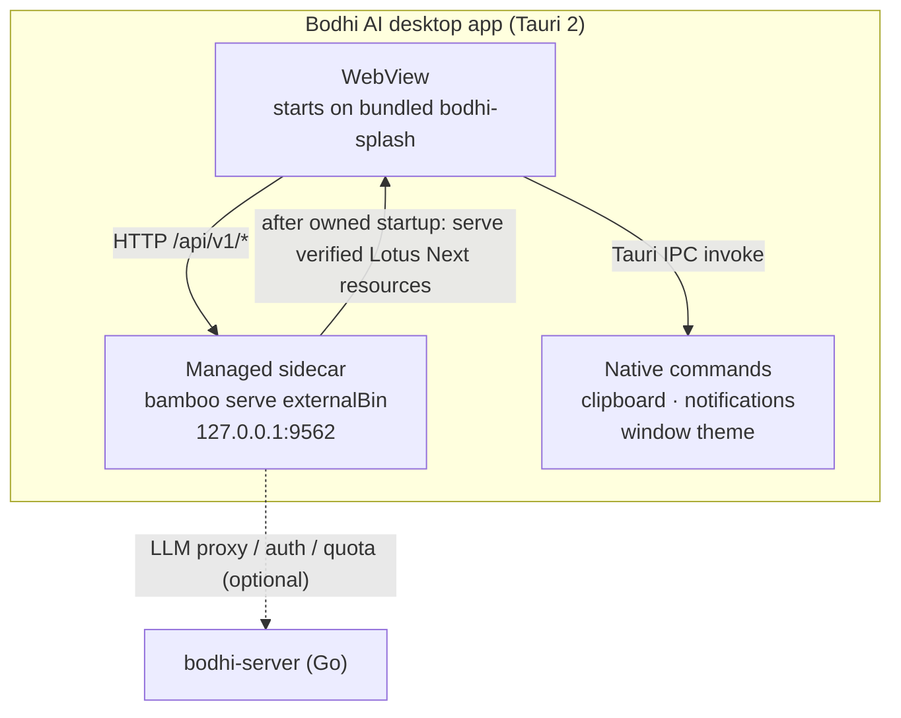

# Bodhi AI

> 📖 中文版请看 **[README.zh-CN.md](./README.zh-CN.md)**

> The desktop AI workbench
>
> This module is the **desktop shell (Tauri) and product surface** within the [Zenith](https://github.com/bigduu/Zenith) monorepo.

---

## The Hook

Bodhi AI turns AI from a chat box into a **desktop work system that actually moves work forward**. You hand it a goal; it breaks the goal into steps, runs tools, reads and writes files, connects to your systems — and **shows every step of its work** instead of just handing you a wall of text. Better still: a one-off useful run can be saved as a reusable workflow, and a workflow can be put on a schedule. AI stops being a disposable answer and becomes an assistant that **compounds in value over time**.

It installs and runs as a real desktop app (Windows / macOS / Linux), with a global hotkey, native notifications, and a managed local engine (sidecar process) — no separate server to babysit.

---

## Key Capabilities at a Glance

| Capability | What it does |
|---|---|
| 🖥️ Native desktop shell | A real desktop app window (Tauri 2), cross-platform packaging (`bundle.targets: all`) |
| ⌨️ Global hotkey | `Cmd/Ctrl + Shift + Space` shows/hides the main window anytime |
| 🔌 Managed sidecar engine | Spawns the standalone `bamboo serve` binary as a managed Tauri sidecar (default port `9562`), killed on app exit |
| 🧰 Install CLI to PATH | Menu item (Help → 安装 bamboo 命令行工具…) puts the bundled `bamboo` on your PATH so `bamboo --help` / `bamboo tui` work in any terminal |
| 🔔 Native notifications | Pushes desktop alerts through the system notification center |
| 📋 Clipboard | Native clipboard writes (macOS / Windows) |
| 🎨 Window theme | Follows the frontend to switch light/dark/system theme |
| 📦 Splash-to-Lotus Next startup | Opens a bundled splash, verifies the local frontend and managed Bamboo startup, then loads the packaged Lotus Next UI |
| 🏢 Build modes | Internal builds show a confirmation dialog at startup; public builds boot straight in |

---

## Architecture

Bodhi owns the desktop window, native integrations (clipboard, notifications, global shortcut), packaging and release. Local and published-package builds use **Lotus Next** for the UI and **Bamboo** for the execution engine. Bodhi bundles a small `bodhi-splash` startup page, verifies the packaged frontend, and starts `bamboo serve --static-dir <owned-resource-directory>` as a managed Tauri sidecar. Once the owned backend is ready and serves the expected production index, the release webview navigates to it. The shell links no Bamboo crate; `bamboo` is declared as an `externalBin` in `tauri.conf.json`. Legacy Lotus remains only as the explicit rollback selection described below.


```mermaid
graph TD
  subgraph Desktop["Bodhi AI desktop app (Tauri 2)"]
    W["WebView<br/>starts on bundled bodhi-splash"]
    E["Managed sidecar<br/>bamboo serve externalBin<br/>127.0.0.1:9562"]
    N["Native commands<br/>clipboard · notifications<br/>window theme"]
    E -- "after owned startup: serve verified Lotus Next resources" --> W
    W -- "HTTP /api/v1/*" --> E
    W -- "Tauri IPC invoke" --> N
  end
  E -. "LLM proxy / auth / quota (optional)" .-> S["bodhi-server (Go)"]
```

**Where this sits in Zenith:**

- **`bodhi`** — desktop AI product surface (this module)
- **`lotus-next`** — the canonical React + Vite UI layer
- **`bamboo`** — the local-first Rust agent runtime (execution engine)
- **`bodhi-server`** — Go backend: auth, persistence, billing+quota, LLM proxy
- **`pavilion`** — official website & docs
- **Zenith (root)** — monorepo entry, submodule pointers, release train

---

## Signature Deep-Dives

### From chat box to work system

This is the product pitch. Ordinary AI hands you text and stops; Bodhi advances a goal into an outcome:

- **Run** — driven by the agent loop: understand the goal → call tools → read/write files / search / execute → pause at approval points → keep moving forward. The process is visible to you (tasks, tool calls, events, state changes).
- **Workflow** — a one-off useful run can be saved as a reusable behavior, then re-run with one click next time.
- **Schedule** — a workflow can be attached to a timed schedule to run automatically.

> Note: the run / workflow / schedule capability — and all tools and agent logic — live in the **Bamboo runtime**. Bodhi's job is to wrap it in a **desktop product you can actually use every day**.

### Managed sidecar process

Instead of linking and running the Bamboo HTTP server in-process, the shell spawns the standalone `bamboo serve` binary as a **Tauri sidecar** (`src-tauri/src/sidecar.rs`) and owns its lifecycle:

- **Bundled startup page**: Tauri's `frontendDist` is `../bodhi-splash`, not `.lotus-dist`. The webview stays on that local splash while the backend starts.
- **Default port `9562`** (`DEFAULT_WEB_SERVICE_PORT`, defined in `src-tauri/src/lib.rs`).
- **Owned local backend**: Lotus Next builds reject an occupied port before spawning. They neither reuse nor kill another listener; the error recommends a different `BODHI_BACKEND_PORT`.
- **Health check and navigation**: Lotus Next builds require the managed child's `Unified server running on http://127.0.0.1:<port>` output, emitted after Bamboo binds, then health and the expected index hash. Errors or termination stop startup. This existing producer signal is also checked during real desktop acceptance when updating Bamboo. Debug builds keep Lotus Next's HMR `devUrl` unless `BODHI_SIDECAR_FRONTEND` is set.
- **Runtime endpoint**: the shell injects its numeric `__BAMBOO_BACKEND_PORT__` before any frontend module evaluates. Lotus Next's existing runtime uses it ahead of persisted browser endpoints; no machine-specific backend URL is compiled into the artifact.
- **Crash-safe orphan guard**: the sidecar is spawned with `--parent-pid <shell_pid>`, so if the app dies *without* running cleanup (SIGKILL, force-quit, panic), the backend self-exits. On the clean path, `RunEvent::Exit` / `ExitRequested` kills the recorded child.
- **No `bamboo-agent` crate dependency**: the shell links no Bamboo crate. `bamboo` is declared as an `externalBin` in `tauri.conf.json` (`"externalBin": ["binaries/bamboo"]`).

The explicit legacy rollback assembly retains its existing external-backend reuse behavior. All Lotus Next assemblies use the owned-process checks above.

### Native desktop integrations

The following Tauri commands are registered in `src-tauri/src/lib.rs` (`invoke_handler`), each with a real implementation:

| Tauri command | Source | Purpose |
|---|---|---|
| `copy_to_clipboard` | `command/copy.rs` | Native clipboard write (falls back to the Web API on Linux) |
| `show_desktop_notification` | `command/notification.rs` | System desktop notification |
| `set_window_theme` | `command/window.rs` | Set window theme (light/dark/system) |
| `is_main_window_focused` | `command/window.rs` | Query whether the main window is focused |

Enabled Tauri plugins: `dialog`, `fs`, `global-shortcut`, `shell`, `process`, `notification`.

Global shortcut: **macOS** `Cmd+Shift+Space`, **Windows/Linux** `Ctrl+Shift+Space` — toggles the main window show/hide.

### Install the bamboo command-line tools

The bundled `bamboo` engine binary lives inside the app bundle (e.g. `Bodhi.app/Contents/MacOS/bamboo` on macOS), so a terminal can't find it. The **Help → 安装 bamboo 命令行工具…** menu item (`src-tauri/src/cli_install.rs`) exposes it on your PATH — after that, `bamboo --help` and `bamboo tui` work from any terminal. A one-time dialog also offers this on first launch.

Per OS:

- **macOS** — creates the symlink `/usr/local/bin/bamboo` → bundled binary. If that needs privileges, a single admin prompt (`osascript … with administrator privileges`) is shown.
- **Windows** — appends the install dir (where `bamboo.exe` sits next to `bodhi.exe`) to the *user* `PATH` (`HKCU\Environment`, `REG_EXPAND_SZ`-safe, deduped) and broadcasts `WM_SETTINGCHANGE`; open a new terminal to pick it up. No admin needed.
- **Linux** — creates the symlink `~/.local/bin/bamboo`; if that dir is not on `$PATH`, the success dialog shows the `export PATH=…` line to add.

Safety: the installer never overwrites a real file or a symlink it doesn't own (only links pointing at a bamboo inside a Bodhi install are refreshed); conflicts abort with a dialog naming the offending path. Re-running when already installed just reports "已安装,指向当前版本".

### How Lotus Next reaches a packaged app

Bodhi consumes sibling `../lotus-next` for local development and `@bigduu/lotus-next` for package assembly. Every local production build runs Lotus Next's build and package-content checks, verifies the production index and asset-manifest references, and hashes every resource. Package assembly additionally verifies the canonical universal manifest, clean source revision, complete inventory, per-file sizes and SHA-256 values, combined digest, and manifest hash against `scripts/frontend-package-lock.json` before replacing generated output. The current lock selects `@bigduu/lotus-next@2026.9.14` from source `ae17b50574ccd86395cbc226b50c9fb2f0f51e0f`.

`.bodhi-frontend/receipt.json` records the package name/version, source revision, dirty-source flag, published-artifact digests where applicable, per-file SHA-256 hashes and a deterministic combined hash. A source identity change during build or staging aborts before the prior generated output is replaced. Dirty local checkouts remain usable and are labeled as dirty; published artifacts must be clean and match the committed lock exactly.

The verified dist is staged in `.lotus-dist/` for inspection and `.bodhi-frontend/dist/` for Tauri resources. Only the latter is bundled at `frontend/dist`; `frontendDist` remains the small splash. The executable pins the exact receipt at compilation and checks resource identity and all file hashes on startup. Missing files, changed bytes, unexpected files and symlinks fail visibly. The resolved resource directory is passed to Bamboo through its existing `--static-dir` option, so moving the app away from the checkout preserves startup. Lotus Next sidecars are compiled with `BAMBOO_FRONTEND_BUILD_MODE=api-only`, avoiding a second embedded UI.

Before Tauri copies resources, the build script replaces only the generated `<Cargo profile>/frontend` directory, after validating its Cargo output ancestry. This prevents deleted hashed assets from surviving a later dev/build copy and falsely failing startup verification. Other build resources and any symlink targets are preserved.

Local production artifacts explicitly clear `VITE_BACKEND_BASE_URL`, including values from frontend `.env` files. A nonempty value supplied by the caller is rejected. Lotus Next's own public-variable schema, bundle budgets and chunk-ownership checks remain authoritative.

| Variable | Default | Description |
|---|---|---|
| `LOTUS_SOURCE` | `local` | Local Lotus Next source; `package` selects a published package. `auto` is rejected |
| `LOTUS_LOCAL_PATH` | `../lotus-next` | Lotus Next Git checkout root; missing or mismatched source fails without fallback |
| `LOTUS_PACKAGE_NAME` | `@bigduu/lotus-next` | Package mode defaults to the locked Lotus Next artifact; explicit `@bigduu/lotus` selects the rollback embed |
| `BAMBOO_LOCAL_PATH` | `../bamboo` | Source of the managed sidecar; required for every Lotus Next Tauri build |

### Published-package and rollback boundary

CI and release jobs default to `LOTUS_SOURCE=package LOTUS_PACKAGE_NAME=@bigduu/lotus-next` and the exact version in the committed lock. They carry the verified dist as the sole frontend, build a real API-only Bamboo sidecar for each declared target, and reject placeholder or wrong-architecture binaries. Package/version mismatch, malformed manifests, corrupt bytes and incomplete bundle output fail closed. Dispatches for the same version are serialized without cancelling an active assembly. Each run uploads only to its own draft tag; after every target and post-build assembly gate succeeds, the final job refuses to overwrite an existing public version and promotes only that run's isolated draft.

The release workflow exposes one `frontend_package` choice for the rollback window. Selecting `@bigduu/lotus` explicitly installs the pinned rollback version `2026.8.28` into Bodhi and Bamboo and retains the prior embedded assembly checks; stale, partial, ambiguous or symlinked producer output is rejected. This path is not an automatic fallback and will be removed only after [Zenith #187](https://github.com/bigduu/Zenith/issues/187) completes its rollback window.

The Zenith release-train orchestrator still needs its own focused ownership/version update before dispatching this workflow. This Bodhi boundary does not publish Lotus Next, dispatch a release, archive legacy Lotus, or certify the broader root/child Jiandu persistence gate. Historical or manual Bamboo checkouts with a rollback embed output symlink fail closed; the existing link and target are left untouched.

### Internal vs public build mode

`is_internal_build_mode()` reads the compile-time `option_env!("BODHI_INTERNAL_BUILD")` or runtime `BODHI_INTERNAL_BUILD`. Internal builds show a startup confirmation dialog; public builds boot straight in. The normal public/internal Tauri variants select this shell mode without invoking legacy frontend rebranding. Existing `rebrand:*` utilities are legacy Lotus maintenance commands and are not part of local Lotus Next assembly.

---

## Quick Start & Development

> All commands below are verified to exist in `bodhi/package.json` / `Cargo.toml`.

### Prerequisites
- Node.js + npm (frontend toolchain)
- Rust toolchain (Tauri backend)
- a sibling `../bamboo` checkout for the real development sidecar
- a sibling `../lotus-next` checkout with dependencies installed (`npm ci` there)

### Develop

```bash
# from the bodhi/ directory
npm run tauri:dev
```

`tauri:dev` follows `beforeDevCommand`: it builds and verifies Lotus Next, stages its resources, builds an API-only debug sidecar from sibling `../bamboo`, and starts Lotus Next's Vite server on loopback port `1420` with strict-port behavior. The window uses `devUrl: http://localhost:1420` for HMR. The same verified resources are available when `BODHI_SIDECAR_FRONTEND` is set to exercise sidecar-served assets in a debug shell.

Branded dev variants:

```bash
npm run tauri:dev:public      # public mode
npm run tauri:dev:internal    # internal mode (startup confirmation)
```

### Build

```bash
npm run tauri:build           # production bundle (bundle.targets: all)
npm run tauri:build:public    # public-mode bundle
npm run tauri:build:internal  # internal-mode bundle
```

`tauri:build` runs `scripts/build-sidecar.cjs` through `beforeBuildCommand`: verified Lotus Next resources plus a release-mode API-only Bamboo sidecar. Tauri bundles the splash, resources and executable. Bare `cargo build` still supports CI shell compilation with inert placeholders; those are not runnable local app assembly.

### Build or preview the selected frontend

```bash
npm run web:build             # build, verify and stage Lotus Next
npm run web:source:info       # report the selected source, or fail with guidance
npm run dev                  # Lotus Next HMR on loopback :1420
npm run preview              # build/verify, then preview Lotus Next on :1420
npm run test:build            # focused source/artifact/assembly fixtures, no Cargo
```

These commands keep Tauri's splash entrypoint unchanged. Preview and HMR commands require a local source checkout; dist-only release packages do not provide a development server.

### Run frontend & backend separately

For browser-only debugging, run the backend and Lotus Next directly. Do not launch local Bodhi against this occupied backend port; the desktop app owns its own engine and will report the collision.

```bash
# Terminal 1: backend (in bamboo/)
cargo run --bin bamboo -- serve --port 9562

# Terminal 2: frontend (in lotus-next/)
npm run dev
```

Run `bamboo serve --help` for the current server options.

For automated desktop acceptance, use disposable Bamboo/Jiandu data, configuration and workspace roots, an isolated Foundation/user home, and an unused `BODHI_BACKEND_PORT`. Enforce denial of access to the user's real `.bamboo` and `.jiandu` stores. Launch the compiled test bundle without installing it, exercise the real app and managed Bamboo twice, verify the app's WebView navigation logs plus the same artifact and local setting/session, and verify the child exits after each complete app exit. Do not install over the user's app or treat a frontend-only browser mock as this acceptance test.

The opt-in managed restart gate packages that contract into one local macOS command:

```bash
npm run test:managed-restart -- --help
```

It is never called by ordinary development, build, package, or CI entrypoints. The command requires exact clean Bodhi and Bamboo revisions, verifies the committed Lotus Next package lock, allocates every mutable Bamboo/Jiandu/Project/provider path under one fresh temporary root, launches the compiled `.app` twice, and pauses on each launch for visual evidence. A deterministic child agent must execute `session_note` into that explicit Jiandu root before the restart, while Project memory and the root/child Session identities must remain readable afterward. The gate refuses dirty inputs and occupied ports, records only synthetic/redacted provider metadata, and preserves its machine-readable report and screenshots for inspection.

The visual record is an explicit headless black-box capture of the exact live managed URL; it is not represented as a native WebView screenshot. Each launch uses a fresh `agent-browser` session and must provide both `browser-launch-N.png` and `browser-launch-N.json`. The receipt binds the launch-specific challenge, exact URL, page title, browser session, observation time, and PNG SHA-256. The harness validates and locks both files while the matching Bodhi app and its exclusively owned Bamboo sidecar are still live, then revalidates them after teardown. The real app logs independently prove that its WebView navigated to that same managed URL.

### Runtime diagnostic env vars

> These are actually read and honored in `src-tauri/src/lib.rs`.

| Variable | Effect |
|---|---|
| `BODHI_OPEN_DEVTOOLS` | Open devtools on launch when truthy |
| `BODHI_WEBVIEW_DIAG` | Inject a diagnostics overlay if the frontend fails to mount, when truthy |
| `BODHI_INTERNAL_BUILD` | Enable the internal-build startup confirmation dialog when truthy |
| `BODHI_BACKEND_PORT` | Override the sidecar backend port (default `9562`) |
| `BODHI_SIDECAR_FRONTEND` | Force the webview to use the sidecar frontend in debug/dev builds |

Frontend `type-check` / `test:run` / `test:e2e` belong to **Lotus Next**. Bodhi runs its focused `test:build` fixtures and the Rust shell tests.

---

## The Rest of the Stack

| Module | Role | Link |
|---|---|---|
| **lotus-next** | Canonical React + Vite UI | [bigduu/lotus-next](https://github.com/bigduu/lotus-next) |
| **bamboo** | local-first Rust agent runtime | [bigduu/Bamboo-agent](https://github.com/bigduu/Bamboo-agent) |
| **bodhi-server** | Go backend: auth / persistence / billing+quota / LLM proxy | [bigduu/bodhi-server](https://github.com/bigduu/bodhi-server) |
| **pavilion** | official website & docs | [bigduu/Pavilion](https://github.com/bigduu/Pavilion) |
| **Zenith (root)** | monorepo entry & release train | [bigduu/Zenith](https://github.com/bigduu/Zenith) |

---

<sub>Release versions are supplied by the release workflow; source manifests intentionally use a placeholder. App identifier: `com.bodhi.app`.</sub>
