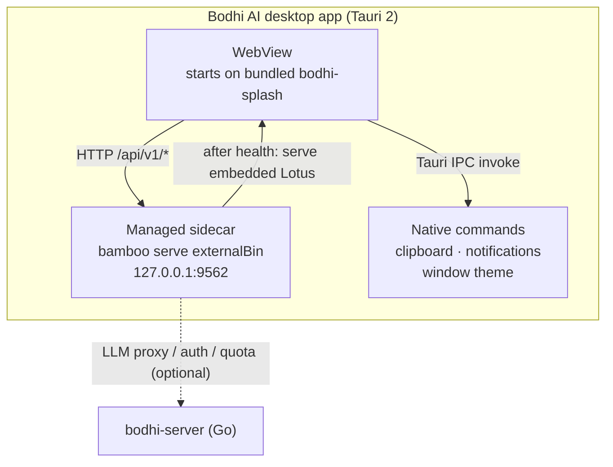

# Bodhi AI

> 📖 中文版请看 **[README.zh-CN.md](./README.zh-CN.md)**

> The desktop AI workbench
>
> This module is the **desktop shell (Tauri) and product surface** within the [Zenith](https://github.com/bigduu/Zenith) monorepo.

---

## The Hook

Bodhi AI turns AI from a chat box into a **desktop work system that actually moves work forward**. You hand it a goal; it breaks the goal into steps, runs tools, reads and writes files, connects to your systems — and **shows every step of its work** instead of just handing you a wall of text. Better still: a one-off useful run can be saved as a reusable workflow, and a workflow can be put on a schedule. AI stops being a disposable answer and becomes an assistant that **compounds in value over time**.

It installs and runs as a real desktop app (Windows / macOS / Linux), with a global hotkey, native notifications, and a managed local engine (sidecar process) — no separate server to babysit.

---

## Key Capabilities at a Glance

| Capability | What it does |
|---|---|
| 🖥️ Native desktop shell | A real desktop app window (Tauri 2), cross-platform packaging (`bundle.targets: all`) |
| ⌨️ Global hotkey | `Cmd/Ctrl + Shift + Space` shows/hides the main window anytime |
| 🔌 Managed sidecar engine | Spawns the standalone `bamboo serve` binary as a managed Tauri sidecar (default port `9562`), killed on app exit |
| 🧰 Install CLI to PATH | Menu item (Help → 安装 bamboo 命令行工具…) puts the bundled `bamboo` on your PATH so `bamboo --help` / `bamboo tui` work in any terminal |
| 🔔 Native notifications | Pushes desktop alerts through the system notification center |
| 📋 Clipboard | Native clipboard writes (macOS / Windows) |
| 🎨 Window theme | Follows the frontend to switch light/dark/system theme |
| 📦 Splash-to-Lotus startup | Opens a bundled startup splash, waits for the managed Bamboo sidecar to become healthy, then loads the Lotus UI served by that sidecar |
| 🏢 Build modes | Internal builds show a confirmation dialog at startup; public builds boot straight in |

---

## Architecture

Bodhi owns only the shell and the product surface — the desktop window, native integrations (clipboard, notifications, global shortcut), packaging and release. The UI comes from **Lotus**; the real execution engine is **Bamboo** (a local-first Rust agent runtime). Bodhi bundles a small `bodhi-splash` startup page, spawns the standalone `bamboo serve` binary as a managed Tauri sidecar, waits for that service to become healthy, and then navigates the release webview to the Lotus UI served by Bamboo. The shell does *not* link `bamboo-agent` as a crate dependency — `bamboo` is declared as an `externalBin` in `tauri.conf.json`.


```mermaid
graph TD
  subgraph Desktop["Bodhi AI desktop app (Tauri 2)"]
    W["WebView<br/>starts on bundled bodhi-splash"]
    E["Managed sidecar<br/>bamboo serve externalBin<br/>127.0.0.1:9562"]
    N["Native commands<br/>clipboard · notifications<br/>window theme"]
    E -- "after health: serve embedded Lotus" --> W
    W -- "HTTP /api/v1/*" --> E
    W -- "Tauri IPC invoke" --> N
  end
  E -. "LLM proxy / auth / quota (optional)" .-> S["bodhi-server (Go)"]
```

**Where this sits in Zenith:**

- **`bodhi`** — desktop AI product surface (this module)
- **`lotus`** — the React + Vite UI layer
- **`bamboo`** — the local-first Rust agent runtime (execution engine)
- **`bodhi-server`** — Go backend: auth, persistence, billing+quota, LLM proxy
- **`pavilion`** — official website & docs
- **Zenith (root)** — monorepo entry, submodule pointers, release train

---

## Signature Deep-Dives

### From chat box to work system

This is the product pitch. Ordinary AI hands you text and stops; Bodhi advances a goal into an outcome:

- **Run** — driven by the agent loop: understand the goal → call tools → read/write files / search / execute → pause at approval points → keep moving forward. The process is visible to you (tasks, tool calls, events, state changes).
- **Workflow** — a one-off useful run can be saved as a reusable behavior, then re-run with one click next time.
- **Schedule** — a workflow can be attached to a timed schedule to run automatically.

> Note: the run / workflow / schedule capability — and all tools and agent logic — live in the **Bamboo runtime**. Bodhi's job is to wrap it in a **desktop product you can actually use every day**.

### Managed sidecar process

Instead of linking and running the Bamboo HTTP server in-process, the shell spawns the standalone `bamboo serve` binary as a **Tauri sidecar** (`src-tauri/src/sidecar.rs`) and owns its lifecycle:

- **Bundled startup page**: Tauri's `frontendDist` is `../bodhi-splash`, not `.lotus-dist`. The webview stays on that local splash while the backend starts.
- **Default port `9562`** (`DEFAULT_WEB_SERVICE_PORT`, defined in `src-tauri/src/lib.rs`).
- **Reuse if the port is taken**: before spawning, it probes `http://127.0.0.1:9562/api/v1/health`; if a backend is already running (e.g. you manually started a standalone bamboo server), it **reuses it** instead of spawning its own, making it easy to debug frontend and backend independently.
- **Health check and navigation**: after spawning, it polls `/api/v1/health` via `wait_for_health` for up to 60 seconds. Release builds then navigate the webview to the sidecar root, where Bamboo serves its embedded Lotus frontend. Debug builds keep Lotus's HMR `devUrl` unless `BODHI_SIDECAR_FRONTEND` is set.
- **Crash-safe orphan guard**: the sidecar is spawned with `--parent-pid <shell_pid>`, so if the app dies *without* running cleanup (SIGKILL, force-quit, panic), the backend self-exits. On the clean path, `RunEvent::Exit` / `ExitRequested` kills the recorded child.
- **No `bamboo-agent` crate dependency**: the shell links no Bamboo crate. `bamboo` is declared as an `externalBin` in `tauri.conf.json` (`"externalBin": ["binaries/bamboo"]`).

> Why it matters: a user opens one app and the engine comes up with it; a developer can still run the backend externally for debugging. Best of both.

### Native desktop integrations

The following Tauri commands are registered in `src-tauri/src/lib.rs` (`invoke_handler`), each with a real implementation:

| Tauri command | Source | Purpose |
|---|---|---|
| `copy_to_clipboard` | `command/copy.rs` | Native clipboard write (falls back to the Web API on Linux) |
| `show_desktop_notification` | `command/notification.rs` | System desktop notification |
| `set_window_theme` | `command/window.rs` | Set window theme (light/dark/system) |
| `is_main_window_focused` | `command/window.rs` | Query whether the main window is focused |

Enabled Tauri plugins: `dialog`, `fs`, `global-shortcut`, `shell`, `process`, `notification`.

Global shortcut: **macOS** `Cmd+Shift+Space`, **Windows/Linux** `Ctrl+Shift+Space` — toggles the main window show/hide.

### Install the bamboo command-line tools

The bundled `bamboo` engine binary lives inside the app bundle (e.g. `Bodhi.app/Contents/MacOS/bamboo` on macOS), so a terminal can't find it. The **Help → 安装 bamboo 命令行工具…** menu item (`src-tauri/src/cli_install.rs`) exposes it on your PATH — after that, `bamboo --help` and `bamboo tui` work from any terminal. A one-time dialog also offers this on first launch.

Per OS:

- **macOS** — creates the symlink `/usr/local/bin/bamboo` → bundled binary. If that needs privileges, a single admin prompt (`osascript … with administrator privileges`) is shown.
- **Windows** — appends the install dir (where `bamboo.exe` sits next to `bodhi.exe`) to the *user* `PATH` (`HKCU\Environment`, `REG_EXPAND_SZ`-safe, deduped) and broadcasts `WM_SETTINGCHANGE`; open a new terminal to pick it up. No admin needed.
- **Linux** — creates the symlink `~/.local/bin/bamboo`; if that dir is not on `$PATH`, the success dialog shows the `export PATH=…` line to add.

Safety: the installer never overwrites a real file or a symlink it doesn't own (only links pointing at a bamboo inside a Bodhi install are refreshed); conflicts abort with a dialog naming the offending path. Re-running when already installed just reports "已安装,指向当前版本".

### How Lotus reaches the packaged app

Bodhi contains only the startup splash; it does not carry a second copy of the product frontend. For a production sidecar build, `scripts/build-sidecar.cjs` runs Bamboo's frontend packaging step and embeds Lotus into the `bamboo` binary. The release workflow checks out the selected Bamboo ref, installs the selected `@bigduu/lotus` package into that checkout, and builds the sidecar in package mode.

`npm run web:build` still stages a Lotus dist in `.lotus-dist/` for CI/source verification. That directory is **not** Tauri's `frontendDist` and is not the production webview entrypoint. Source selection for staging and sidecar packaging uses:

| Variable | Default | Description |
|---|---|---|
| `LOTUS_SOURCE` | `auto` | `auto` \| `local` \| `package`. `auto` prefers the local `../lotus`, otherwise uses the npm package |
| `LOTUS_LOCAL_PATH` | `../lotus` | Local Lotus checkout path |
| `LOTUS_PACKAGE_NAME` | `@bigduu/lotus` | Published Lotus npm package name |

### Internal vs public build mode

`is_internal_build_mode()` reads the compile-time `option_env!("BODHI_INTERNAL_BUILD")` or runtime `BODHI_INTERNAL_BUILD`. Internal builds show a startup confirmation dialog; public builds boot straight in. Frontend rebranding is driven by Lotus's rebrand scripts (`npm run rebrand:public` / `rebrand:internal`, proxied from `bodhi/package.json`).

---

## Quick Start & Development

> All commands below are verified to exist in `bodhi/package.json` / `Cargo.toml`.

### Prerequisites
- Node.js + npm (frontend toolchain)
- Rust toolchain (Tauri backend)
- a sibling `../bamboo` checkout for the real development sidecar
- a sibling `../lotus` checkout for the HMR development frontend

### Develop

```bash
# from the bodhi/ directory
npm run tauri:dev
```

`tauri:dev` follows `beforeDevCommand`: it builds a debug sidecar from sibling `../bamboo`, starts sibling `../lotus` with Vite HMR, and then launches the Tauri window at `devUrl: http://localhost:1420`. Development does not use `.lotus-dist` as the webview source.

Branded dev variants:

```bash
npm run tauri:dev:public      # public mode
npm run tauri:dev:internal    # internal mode (startup confirmation)
```

### Build

```bash
npm run tauri:build           # production bundle (bundle.targets: all)
npm run tauri:build:public    # public-mode bundle
npm run tauri:build:internal  # internal-mode bundle
```

`tauri:build` runs `scripts/build-sidecar.cjs` through `beforeBuildCommand`. With a sibling Bamboo checkout, that script packages Lotus into a release-mode Bamboo sidecar; Tauri itself still bundles `bodhi-splash` as `frontendDist`. The release workflow performs the same assembly from an explicit Bamboo ref and Lotus package version for each target platform.

### Stage Lotus assets for verification

```bash
npm run web:build             # build/stage Lotus into .lotus-dist for verification
npm run web:source:info       # print the current Lotus source (local/package + LOTUS_SOURCE)
```

These commands do not change Tauri's `frontendDist`; the packaged app still starts from `bodhi-splash` and receives Lotus from the healthy sidecar.

### Run frontend & backend separately

Because the sidecar reuses an existing backend if the port is already in use, you can run a standalone backend for debugging. The Bamboo backend entry point is the `serve` subcommand of the `bamboo` binary (in the `bamboo/` directory):

```bash
# Terminal 1: backend (in bamboo/)
cargo run --bin bamboo -- serve --port 9562

# Terminal 2: frontend (in lotus/)
npm run dev
```

Run `bamboo serve --help` for the current server options.

### Runtime diagnostic env vars

> These are actually read and honored in `src-tauri/src/lib.rs`.

| Variable | Effect |
|---|---|
| `BODHI_OPEN_DEVTOOLS` | Open devtools on launch when truthy |
| `BODHI_WEBVIEW_DIAG` | Inject a diagnostics overlay if the frontend fails to mount, when truthy |
| `BODHI_INTERNAL_BUILD` | Enable the internal-build startup confirmation dialog when truthy |
| `BODHI_BACKEND_PORT` | Override the sidecar backend port (default `9562`) |
| `BODHI_SIDECAR_FRONTEND` | Force the webview to use the sidecar frontend in debug/dev builds |

> Note: this module does NOT define `type-check` / `test:run` / `test:e2e` — those belong to **Lotus**. Bodhi's `package.json` only contains the web/rebrand/tauri scripts listed above.

---

## The Rest of the Stack

| Module | Role | Link |
|---|---|---|
| **lotus** | React + Vite UI layer | [bigduu/Lotus](https://github.com/bigduu/Lotus) |
| **bamboo** | local-first Rust agent runtime | [bigduu/Bamboo-agent](https://github.com/bigduu/Bamboo-agent) |
| **bodhi-server** | Go backend: auth / persistence / billing+quota / LLM proxy | [bigduu/bodhi-server](https://github.com/bigduu/bodhi-server) |
| **pavilion** | official website & docs | [bigduu/Pavilion](https://github.com/bigduu/Pavilion) |
| **Zenith (root)** | monorepo entry & release train | [bigduu/Zenith](https://github.com/bigduu/Zenith) |

---

<sub>Release versions are supplied by the release workflow; source manifests intentionally use a placeholder. App identifier: `com.bodhi.app`.</sub>
