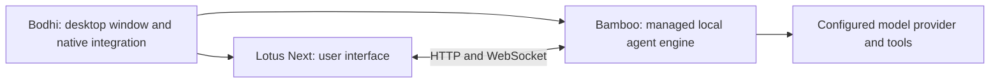

# Bodhi AI

[English](README.md) · [简体中文](README.zh-CN.md)

**Your local-first AI agent, in a desktop window.** Hand it a task, watch every
tool call and approval, and keep working without a backend terminal open. Bodhi
starts and stops its bundled Bamboo agent runtime for you and opens the Lotus
Next interface.

[Download](https://github.com/bigduu/Bodhi-AI/releases/latest) · Part of [Bodhi / Zenith](https://github.com/bigduu/Zenith) · [Development guide](docs/development.md) · [MIT](LICENSE)

<p align="center"></p>

*Lotus Next recorded in a browser against Bamboo source with demo data; no model call. The packaged app may use an earlier Lotus Next build.*

- **Works on your projects:** reads and edits files, runs commands and searches
  or fetches web pages, asking for approval before risky actions.
- **Keeps working on a schedule:** cron-style schedules and workflows in the
  bundled Bamboo runtime.
- **Your choice of model:** Anthropic, OpenAI (and OpenAI-compatible endpoints),
  Gemini or GitHub Copilot.
- **Extends with MCP:** the Homebrew install also adds the
  [Jiandu](https://github.com/bigduu/Jiandu) (shared memory) and
  [Nova](https://github.com/bigduu/Nova) (native app control) command-line
  tools, which you can add as MCP servers.

## Install

| Platform | How |
|---|---|
| macOS (recommended) | `brew tap bigduu/tap && brew trust bigduu/tap && brew install --cask bigduu/tap/bodhi` |
| macOS (manual) | Apple Silicon or Intel `.dmg` from [Releases](https://github.com/bigduu/Bodhi-AI/releases/latest); not notarized yet, so run the [self-sign script](./scripts/self-sign-macos-app.sh) or use Homebrew |
| Windows x64 | `-setup.exe` (unsigned; SmartScreen may warn) |
| Linux x64 | `.AppImage`, `.deb` or `.rpm` (needs a graphical session and WebKitGTK runtime) |

Then open **Settings → Provider** (shown as **设置 → 提供方** in the current release, whose settings screen is not translated yet), add a key for a provider you can access, and
try: *"Explain this folder, then suggest one small improvement."* Start with a
small sample project before asking for file changes. A model provider is still
required: local execution does not mean the model runs locally or that requests
never leave your machine.

The table reflects [app-v2026.9.20](https://github.com/bigduu/Bodhi-AI/releases/tag/app-v2026.9.20), the latest public release on 2026-10-04. It is an artifact inventory, not a claim that every OS was tested in this documentation refresh. For source builds, follow the [Tauri platform prerequisites](https://v2.tauri.app/start/prerequisites/).

### Homebrew details

```sh
brew tap bigduu/tap
brew trust bigduu/tap
brew install --cask bigduu/tap/bodhi
```

`brew trust` explicitly trusts this third-party tap, including future packages from it, so Homebrew can load the cask's formula dependencies. The [Bodhi cask](https://github.com/bigduu/homebrew-tap) selects the Apple Silicon or Intel DMG and installs the **Jiandu** and **Nova** command-line tools. Bodhi already bundles its Bamboo engine. Installing Jiandu and Nova does not configure an MCP host; Nova also needs macOS permissions for computer control.

**Current macOS signing:** the published DMG is ad-hoc signed and is not Developer ID notarized. During Homebrew installation, the cask automatically removes quarantine from the installed app, re-signs it locally with an ad-hoc signature while preserving the hardened runtime, and verifies the signature. No manual self-sign step is needed for this installation path. This does not provide Developer ID trust or notarization, and macOS privacy permissions may need to be granted again after upgrades. Direct DMG installations can use [the self-sign script](./scripts/self-sign-macos-app.sh); formal signing is tracked in [Bodhi #75](https://github.com/bigduu/Bodhi-AI/issues/75).

## Work with it

- **Return to your work quickly:** `Cmd+Shift+Space` on macOS or `Ctrl+Shift+Space` on Windows/Linux toggles the main window, when the OS allows the shortcut.
- **Keep execution visible:** Lotus Next presents conversations, tool calls and permission prompts; Bamboo performs the work. Available tools and workflows depend on the bundled runtime and your configuration.
- **Use the same engine from a terminal:** **Help → 安装 bamboo 命令行工具…** exposes the bundled CLI on your PATH. Then try `bamboo --help` or `bamboo tui`. On macOS, installation into `/usr/local/bin` may request administrator permission; Windows updates user PATH, and Linux uses `~/.local/bin`.
- **Manage one local engine:** closing the app shuts down its owned sidecar. The default backend port is `9562`; an occupied port is reported instead of taking over another process. `BODHI_BACKEND_PORT` selects a different port.

## How the pieces fit


```mermaid
flowchart LR
  Bodhi["Bodhi: desktop window and native integration"] --> Lotus["Lotus Next: user interface"]
  Bodhi --> Bamboo["Bamboo: managed local agent engine"]
  Lotus <-->|"HTTP and WebSocket"| Bamboo
  Bamboo --> Provider["Configured model provider and tools"]
```

Bodhi packages a startup page, verified frontend resources and a standalone `bamboo serve` sidecar. It does not link the Bamboo runtime as a Rust library. [Nova](https://github.com/bigduu/Nova) provides separately configured computer/browser tools; installing the shell alone does not establish that those tools are ready. [bodhi-server](https://github.com/bigduu/bodhi-server) is a separate service for hosted account/proxy use, not the local engine.

## Source checkout versus released app

The README describes the Zenith-pinned source. As checked on 2026-10-03:

| Layer | Identity | Frontend selection |
|---|---|---|
| Public desktop release | `app-v2026.9.20` | Lotus Next `2026.9.16` |
| Zenith-pinned Bodhi source | `6d85036` | Lotus Next `2026.9.22` in the package lock |
| Upstream `main` observed | `d0e40e8` | Contains changes after the Zenith pin |

A newer npm frontend does not update an already released desktop installer. Source manifests use `0.0.0` intentionally; the release workflow supplies the app version. See [evidence and limits](docs/readme-audit.md). Features on other branches are not advertised as released here.

## Develop from Zenith

Initialize Zenith's submodules at its recorded pins, then install both UI and shell dependencies. Current macOS source builds require macOS 13.5+. Use Node.js 22.12+ (Lotus Next's declared minimum), npm, Rust 1.95+ (the pinned Bamboo requirement) and the platform-specific Tauri prerequisites.

```bash
# From the Zenith checkout
(cd lotus-next && npm ci)
cd bodhi
npm ci
npm run tauri:dev
```

This uses sibling `../lotus-next` and `../bamboo`. The development command checks port `1420` before building the real API-only Bamboo sidecar and frontend resources, verifies its own Vite process, then starts the native app. The window stays on a startup page until its managed Bamboo is ready. Exiting the command stops its owned development processes. Lotus HMR uses port `1420`, and Bamboo uses `9562` by default; an existing listener is reported and left untouched.

```bash
npm run tauri:build     # Assemble a production desktop bundle
npm run test:build      # Source-selection and assembly tests (no Cargo)
```

For browser-only development, use the [Lotus Next README](https://github.com/bigduu/lotus-next). Detailed source selection, package verification, diagnostics, bundled browser runtime and isolated macOS restart acceptance remain in the [development guide](docs/development.md).

## License

Project-owned code and documentation are licensed under the [MIT License](./LICENSE).
Third-party components retain their respective licenses and copyright notices.
