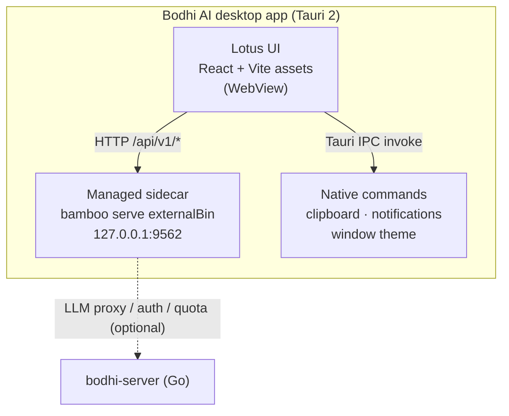

# Bodhi AI

> 📖 For English, see **[README.md](./README.md)**

> 桌面 AI 工作台
>
> 这是 [Zenith](https://github.com/bigduu/Zenith) 单仓中的 **桌面外壳（Tauri shell）+ 产品门面** 模块。

---

## 这是什么

Bodhi AI 把 AI 从一个"聊天框"变成一台**会干活的桌面工作台**。你下达一个目标，它会把任务拆成步骤、调用工具、读写文件、连接你的工具系统，并且**把每一步都摊在你面前**——你看得见它在做什么，而不是只给你一段文字。更妙的是：一次好用的运行可以被沉淀为可复用的流程，流程又可以挂上定时计划。AI 不再是一次性的回答，而是会随时间**越用越值钱**的助手。

它以一个真正的桌面应用安装并运行（Windows / macOS / Linux），带全局快捷键、原生通知，以及一个托管的本地引擎（sidecar 进程）——无需单独照看的服务器。

---

## 核心能力一览

| 能力 | 说明 |
|---|---|
| 🖥️ 桌面原生外壳 | 真正的桌面应用窗口（Tauri 2），跨平台打包 (`bundle.targets: all`) |
| ⌨️ 全局唤起 | `Cmd/Ctrl + Shift + Space` 随时显示/隐藏主窗口 |
| 🔌 托管 sidecar 引擎 | 将独立的 `bamboo serve` 二进制作为托管 Tauri sidecar 拉起（默认端口 `9562`），应用退出时自动终止 |
| 🔔 系统通知 | 通过系统通知中心推送桌面提醒 |
| 📋 系统剪贴板 | 原生剪贴板写入（macOS / Windows） |
| 🎨 主题同步 | 跟随前端切换浅色/深色/系统主题 |
| 📦 Lotus 资产装配 | 通过 `LOTUS_SOURCE` 在本地源码或 npm 包之间选择前端来源 |
| 🏢 内部/公开构建 | 内部构建启动时弹出确认对话框，公开构建直接进入 |

---

## 架构

Bodhi 只负责"外壳"和"产品门面"：它拥有桌面窗口、原生集成（剪贴板、通知、全局快捷键）、打包与发布；前端 UI 由 **Lotus** 提供；真正的执行引擎是 **Bamboo**（Rust 本地优先 agent 运行时）。关键点：Bodhi **将独立的 `bamboo serve` 二进制作为托管的 Tauri sidecar 进程拉起**，并管理其生命周期。外壳**不**以 crate 依赖的形式链接 `bamboo-agent`——`bamboo` 在 `tauri.conf.json` 中声明为 `externalBin`。Lotus 前端通过 HTTP 与这个本地服务通信。



**Zenith 全栈定位：**

- **`bodhi`** — 桌面产品门面（Tauri 外壳，即本模块）
- **`lotus`** — React + Vite 前端 UI 层
- **`bamboo`** — 本地优先 Rust agent 运行时（执行引擎）
- **`bodhi-server`** — Go 后端：认证 / 持久化 / 计费配额 / LLM 代理
- **`pavilion`** — 官网与文档
- **Zenith (root)** — 单仓入口 + 子模块指针 + 发布列车

---

## 招牌深潜

### 把 AI 变成工作系统

这是 Bodhi 的产品主张。普通 AI 给你一段文字就结束了；Bodhi 把一个目标推进成结果：

- **Run（运行）** — agent 循环驱动：理解目标 → 调用工具 → 读写文件 / 搜索 / 执行 → 在审批点暂停 → 继续推进。过程对你可见（任务、工具调用、事件、状态变化）。
- **Workflow（工作流）** — 一次好用的运行可以被保存为可复用的行为，下次一键复跑。
- **Schedule（计划）** — 工作流可以挂到定时计划上自动运行。

> 注意：运行 / 工作流 / 计划这套能力以及全部工具与 agent 逻辑都来自 **Bamboo 运行时**。Bodhi 的职责是把它装进一个**真正能每天用的桌面产品**里。

### 托管的 sidecar 进程

外壳不再把 Bamboo HTTP 服务以进程内方式链接运行，而是将独立的 `bamboo serve` 二进制作为 **Tauri sidecar** 拉起（`src-tauri/src/sidecar.rs`），并管理其生命周期：

- **默认端口 `9562`**（`DEFAULT_WEB_SERVICE_PORT`，定义在 `src-tauri/src/lib.rs`）。
- **端口已占用则复用**：拉起前先探测 `http://127.0.0.1:9562/api/v1/health`；若已有后端在跑（例如你手动起了独立 bamboo server），则**直接复用**而不重复拉起，方便前后端独立调试。
- **健康检查**：拉起后通过 `wait_for_health` 轮询 `/api/v1/health`（最长 60 秒），就绪后才把 webview 导航到 sidecar。
- **崩溃安全的孤儿守护**：sidecar 拉起时带 `--parent-pid <shell_pid>`，若应用异常死亡（SIGKILL、强制退出、panic），后端会自行退出。正常退出路径中，`RunEvent::Exit` / `ExitRequested` 会 kill 已记录的子进程。
- **无 `bamboo-agent` crate 依赖**：外壳不链接任何 Bamboo crate。`bamboo` 在 `tauri.conf.json` 中声明为 `externalBin`（`"externalBin": ["binaries/bamboo"]`）。

> 为什么重要：用户只需打开一个应用，引擎随之启动；同时开发者仍可在外部单独运行后端做调试——两全其美。

### 桌面原生集成

`src-tauri/src/lib.rs` 注册了以下 Tauri 命令（`invoke_handler`），均有实际实现：

| Tauri command | 源文件 | 作用 |
|---|---|---|
| `copy_to_clipboard` | `command/copy.rs` | 原生剪贴板写入（Linux 上回退到 Web API） |
| `show_desktop_notification` | `command/notification.rs` | 系统桌面通知 |
| `set_window_theme` | `command/window.rs` | 设置窗口主题（light/dark/system） |
| `is_main_window_focused` | `command/window.rs` | 查询主窗口是否聚焦 |

启用的 Tauri 插件：`dialog`、`fs`、`global-shortcut`、`shell`、`process`、`notification`。

全局快捷键：**macOS** `Cmd+Shift+Space`，**Windows/Linux** `Ctrl+Shift+Space` — 切换主窗口显示/隐藏。

### Lotus 前端来源选择

Bodhi 不自带前端源码——它在构建/开发时从 Lotus **装配**前端资产（`scripts/lotus-dist.cjs`，输出到 `.lotus-dist/`）。通过环境变量控制来源：

| 变量 | 默认 | 说明 |
|---|---|---|
| `LOTUS_SOURCE` | `auto` | `auto` \| `local` \| `package`。`auto` 优先用本地 `../lotus`，否则用 npm 包 |
| `LOTUS_LOCAL_PATH` | `../lotus` | 本地 Lotus 检出路径 |
| `LOTUS_PACKAGE_NAME` | `@bigduu/lotus` | 已发布的 Lotus npm 包名 |

### 内部 / 公开构建模式

`src-tauri/src/lib.rs` 中 `is_internal_build_mode()` 读取编译期 `option_env!("BODHI_INTERNAL_BUILD")` 或运行期 `BODHI_INTERNAL_BUILD` 环境变量。内部构建在启动时弹出确认对话框（"This is an internal development build…"），公开构建直接进入。前端品牌相关开关由 Lotus 的 rebrand 脚本驱动（`npm run rebrand:public` / `rebrand:internal`，已在 `bodhi/package.json` 透传）。

---

## 快速开始与开发

> 以下命令均已在 `bodhi/package.json` / `Cargo.toml` 中核实存在。

### 前置
- Node.js + npm（前端工具链）
- Rust toolchain（Tauri 后端）
- 同级 `../lotus` 检出，或已安装的 `@bigduu/lotus` 包

### 开发

```bash
# 在 bodhi/ 目录下
npm run tauri:dev
```

`tauri:dev` 会先运行 `web:dev`（即 `cd ../lotus && npm run dev`），再启动 Tauri 开发窗口（`devUrl: http://localhost:1420`）。

带品牌模式的开发：

```bash
npm run tauri:dev:public      # 公开模式
npm run tauri:dev:internal    # 内部模式（带启动确认）
```

### 构建

```bash
npm run tauri:build           # 生产打包（bundle.targets: all）
npm run tauri:build:public    # 公开模式打包
npm run tauri:build:internal  # 内部模式打包
```

`tauri:build` 的 `beforeBuildCommand` 会先构建 Lotus 并把产物装配到 `.lotus-dist/`（`frontendDist: ../.lotus-dist`）。

### 仅装配前端资产

```bash
npm run web:build             # 构建 Lotus 并装配到 .lotus-dist
npm run web:source:info       # 打印当前 Lotus 来源（local/package + LOTUS_SOURCE）
```

### 前后端独立调试

由于 sidecar 在端口已被占用时会复用已有后端，你可以手动起独立后端来调试。Bamboo 后端的入口是 `bamboo` 二进制的 `serve` 子命令（在 `bamboo/` 目录）：

```bash
# 终端 1：后端（in bamboo/）
cargo run --bin bamboo -- serve --port 9562

# 终端 2：前端（in lotus/）
npm run dev
```

`serve` 支持的参数：`--port`、`--bind`、`--data-dir`、`--static-dir`、`--workers`。

### 运行时诊断环境变量

> 以下变量在 `src-tauri/src/lib.rs` 中实际读取并生效。

| 变量 | 作用 |
|---|---|
| `BODHI_OPEN_DEVTOOLS` | 真值时启动后自动打开 WebView 开发者工具 |
| `BODHI_WEBVIEW_DIAG` | 真值时若前端未挂载，注入诊断覆盖层 |
| `BODHI_INTERNAL_BUILD` | 真值时启用内部构建启动确认对话框 |
| `BODHI_BACKEND_PORT` | 覆盖 sidecar 后端端口（默认 `9562`） |
| `BODHI_SIDECAR_FRONTEND` | 在 debug/dev 构建中强制 webview 使用 sidecar 前端 |

> ⚠️ 说明：本仓不提供 `npm run type-check` / `test:run` / `test:e2e` 这类脚本——这些属于 **Lotus**。Bodhi 的 `package.json` 只包含上面列出的 web/rebrand/tauri 脚本。

---

## 其余技术栈

| 模块 | 角色 | 链接 |
|---|---|---|
| **lotus** | React + Vite 前端 UI 层 | [`../lotus`](../lotus) |
| **bamboo** | 本地优先 Rust agent 运行时（执行引擎） | [`../bamboo`](../bamboo) |
| **bodhi-server** | Go 后端：认证 / 持久化 / 计费配额 / LLM 代理 | [`../bodhi-server`](../bodhi-server) |
| **pavilion** | 官网与文档 | [`../pavilion`](../pavilion) |
| **Zenith (root)** | 单仓入口 + 子模块指针 + 发布列车 | [`../`](../) |

---

<sub>版本: `2026.4.24`（见 `package.json` / `tauri.conf.json` / `Cargo.toml`） · Identifier: `com.bodhi.app` · 此文档随代码核实，请以源码为准。</sub>
