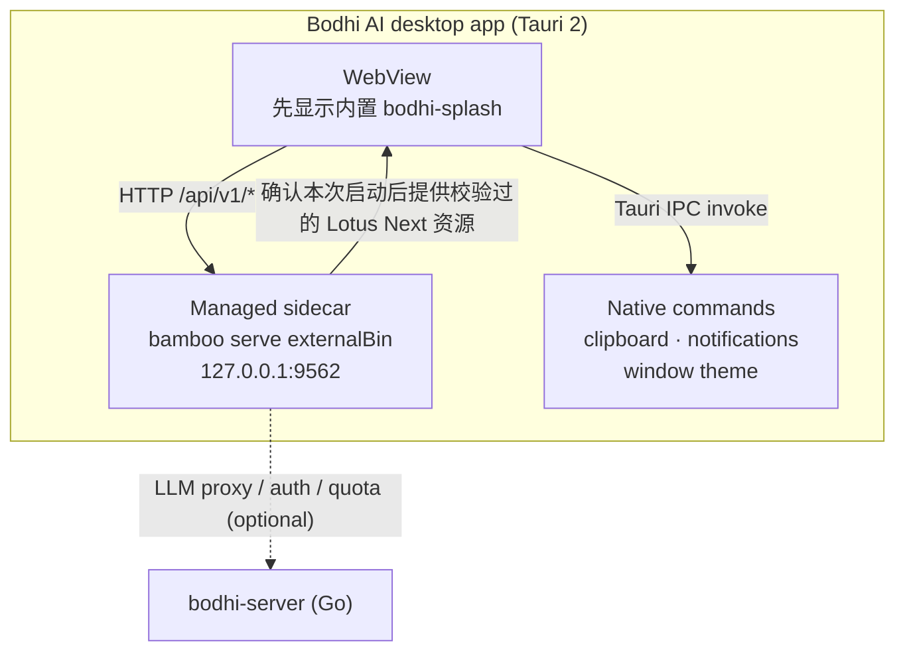

# Bodhi AI

> 📖 For English, see **[README.md](./README.md)**

> 桌面 AI 工作台
>
> 这是 [Zenith](https://github.com/bigduu/Zenith) 单仓中的 **桌面外壳（Tauri shell）+ 产品门面** 模块。

---

## 这是什么

Bodhi AI 把 AI 从一个"聊天框"变成一台**会干活的桌面工作台**。你下达一个目标，它会把任务拆成步骤、调用工具、读写文件、连接你的工具系统，并且**把每一步都摊在你面前**——你看得见它在做什么，而不是只给你一段文字。更妙的是：一次好用的运行可以被沉淀为可复用的流程，流程又可以挂上定时计划。AI 不再是一次性的回答，而是会随时间**越用越值钱**的助手。

它以一个真正的桌面应用安装并运行（Windows / macOS / Linux），带全局快捷键、原生通知，以及一个托管的本地引擎（sidecar 进程）——无需单独照看的服务器。

---

## 核心能力一览

| 能力 | 说明 |
|---|---|
| 🖥️ 桌面原生外壳 | 真正的桌面应用窗口（Tauri 2），跨平台打包 (`bundle.targets: all`) |
| ⌨️ 全局唤起 | `Cmd/Ctrl + Shift + Space` 随时显示/隐藏主窗口 |
| 🔌 托管 sidecar 引擎 | 将独立的 `bamboo serve` 二进制作为托管 Tauri sidecar 拉起（默认端口 `9562`），应用退出时自动终止 |
| 🧰 安装命令行工具 | 菜单（Help → 安装 bamboo 命令行工具…）把内置的 `bamboo` 加入 PATH，任意终端可运行 `bamboo --help` / `bamboo tui` |
| 🔔 系统通知 | 通过系统通知中心推送桌面提醒 |
| 📋 系统剪贴板 | 原生剪贴板写入（macOS / Windows） |
| 🎨 主题同步 | 跟随前端切换浅色/深色/系统主题 |
| 📦 Splash 到 Lotus Next 启动链 | 先显示内置启动页，校验本地前端与托管 Bamboo 启动，再加载打包的 Lotus Next UI |
| 🏢 内部/公开构建 | 内部构建启动时弹出确认对话框，公开构建直接进入 |

---

## 架构

Bodhi 负责桌面窗口、原生集成（剪贴板、通知、全局快捷键）、打包与发布。本地和已发布包构建都使用 **Lotus Next** 前端与 **Bamboo** 执行引擎。应用先显示 `bodhi-splash`，校验包内前端，再通过 `bamboo serve --static-dir <应用资源目录>` 启动托管 sidecar。确认本次启动的引擎已经就绪且提供预期的生产首页后，release WebView 才导航过去。外壳不链接 Bamboo crate；`bamboo` 在 `tauri.conf.json` 中声明为 `externalBin`。旧 Lotus 仅作为下文所述的显式回滚选择保留。



**Zenith 全栈定位：**

- **`bodhi`** — 桌面产品门面（Tauri 外壳，即本模块）
- **`lotus-next`** — 规范的 React + Vite 前端 UI 层
- **`bamboo`** — 本地优先 Rust agent 运行时（执行引擎）
- **`bodhi-server`** — Go 后端：认证 / 持久化 / 计费配额 / LLM 代理
- **`pavilion`** — 官网与文档
- **Zenith (root)** — 单仓入口 + 子模块指针 + 发布列车

---

## 招牌深潜

### 把 AI 变成工作系统

这是 Bodhi 的产品主张。普通 AI 给你一段文字就结束了；Bodhi 把一个目标推进成结果：

- **Run（运行）** — agent 循环驱动：理解目标 → 调用工具 → 读写文件 / 搜索 / 执行 → 在审批点暂停 → 继续推进。过程对你可见（任务、工具调用、事件、状态变化）。
- **Workflow（工作流）** — 一次好用的运行可以被保存为可复用的行为，下次一键复跑。
- **Schedule（计划）** — 工作流可以挂到定时计划上自动运行。

> 注意：运行 / 工作流 / 计划这套能力以及全部工具与 agent 逻辑都来自 **Bamboo 运行时**。Bodhi 的职责是把它装进一个**真正能每天用的桌面产品**里。

### 托管的 sidecar 进程

外壳不再把 Bamboo HTTP 服务以进程内方式链接运行，而是将独立的 `bamboo serve` 二进制作为 **Tauri sidecar** 拉起（`src-tauri/src/sidecar.rs`），并管理其生命周期：

- **内置启动页**：Tauri 的 `frontendDist` 是 `../bodhi-splash`，不是 `.lotus-dist`。后端启动期间，webview 保持在这个本地 splash。
- **默认端口 `9562`**（`DEFAULT_WEB_SERVICE_PORT`，定义在 `src-tauri/src/lib.rs`）。
- **拥有自己的本地引擎**：Lotus Next 构建会在启动前拒绝已占用端口，不复用或终止其他监听进程。错误提示会建议用 `BODHI_BACKEND_PORT` 选择其他端口。
- **健康检查与导航**：Lotus Next 构建先要求托管子进程输出 `Unified server running on http://127.0.0.1:<port>`；该日志在 Bamboo 成功绑定端口后才产生。然后检查健康状态与预期首页哈希。启动错误或子进程退出都会中止启动。升级 Bamboo 时，真实桌面验收也需要覆盖这个已有日志约定。debug 构建保留 Lotus Next HMR 的 `devUrl`，除非设置 `BODHI_SIDECAR_FRONTEND`。
- **运行时地址**：外壳在任何前端模块执行前注入数字 `__BAMBOO_BACKEND_PORT__`。Lotus Next 的现有运行时优先使用它，避免浏览器曾保存的地址改变本次桌面后端；产物不编译机器专属后端地址。
- **崩溃安全的孤儿守护**：sidecar 拉起时带 `--parent-pid <shell_pid>`，若应用异常死亡（SIGKILL、强制退出、panic），后端会自行退出。正常退出路径中，`RunEvent::Exit` / `ExitRequested` 会 kill 已记录的子进程。
- **无 `bamboo-agent` crate 依赖**：外壳不链接任何 Bamboo crate。`bamboo` 在 `tauri.conf.json` 中声明为 `externalBin`（`"externalBin": ["binaries/bamboo"]`）。

显式选择的旧 Lotus 回滚流程仍沿用原来的外部服务复用行为。所有 Lotus Next 组装始终使用上述进程归属检查。

### 桌面原生集成

`src-tauri/src/lib.rs` 注册了以下 Tauri 命令（`invoke_handler`），均有实际实现：

| Tauri command | 源文件 | 作用 |
|---|---|---|
| `copy_to_clipboard` | `command/copy.rs` | 原生剪贴板写入（Linux 上回退到 Web API） |
| `show_desktop_notification` | `command/notification.rs` | 系统桌面通知 |
| `set_window_theme` | `command/window.rs` | 设置窗口主题（light/dark/system） |
| `is_main_window_focused` | `command/window.rs` | 查询主窗口是否聚焦 |

启用的 Tauri 插件：`dialog`、`fs`、`global-shortcut`、`shell`、`process`、`notification`。

全局快捷键：**macOS** `Cmd+Shift+Space`，**Windows/Linux** `Ctrl+Shift+Space` — 切换主窗口显示/隐藏。

### 安装 bamboo 命令行工具

内置的 `bamboo` 引擎二进制位于应用包内部（macOS 上是 `Bodhi.app/Contents/MacOS/bamboo`），终端找不到它。菜单 **Help → 安装 bamboo 命令行工具…**（`src-tauri/src/cli_install.rs`）会把它暴露到 PATH —— 之后任意终端都能运行 `bamboo --help`、`bamboo tui`。首次启动也会弹一次性的安装询问。

各平台行为：

- **macOS** — 创建软链接 `/usr/local/bin/bamboo` → 内置二进制；权限不足时弹一次管理员授权（`osascript … with administrator privileges`）。
- **Windows** — 把安装目录（`bamboo.exe` 与 `bodhi.exe` 同目录）追加到**用户** `PATH`（`HKCU\Environment`，保持 `REG_EXPAND_SZ` 类型、自动去重）并广播 `WM_SETTINGCHANGE`；打开新终端即可生效,无需管理员。
- **Linux** — 创建软链接 `~/.local/bin/bamboo`；若该目录不在 `$PATH`,成功对话框会给出要添加的 `export PATH=…` 行。

安全规则：绝不覆盖普通文件或不属于 Bodhi 的软链接（只会刷新指向 Bodhi 安装内 bamboo 的旧链接）;冲突时中止并在对话框中指明冲突路径。已安装时重复执行只提示「已安装,指向当前版本」。

### Lotus Next 如何进入打包应用

Bodhi 在本地开发时读取同级 `../lotus-next`，在 package 组装时读取 `@bigduu/lotus-next`。本地生产构建执行 Lotus Next 自身的 build 与 package-content 校验，再验证生产首页、asset-manifest 引用和所有文件哈希。package 组装还会在替换任何生成输出前，对照 `scripts/frontend-package-lock.json` 校验规范化 universal manifest、干净源码提交、完整文件清单、逐文件大小与 SHA-256、组合摘要和 manifest 哈希。当前锁定 `@bigduu/lotus-next@2026.9.16`，源码为 `0495772ecab37402c3915c10a6c945cf286a132b`。

`.bodhi-frontend/receipt.json` 记录包名、版本、源码提交、dirty 标记、适用时的发布产物摘要、逐文件 SHA-256 和确定性的整体哈希。构建或装配期间身份变化会在替换已有生成输出前中止。本地有改动的检出仍可使用并明确标记 dirty；发布包必须来自干净源码且与提交锁完全一致。

校验后的 dist 同时装配到 `.lotus-dist/`（便于检查）和 `.bodhi-frontend/dist/`（Tauri 资源）。仅后者以 `frontend/dist` 打包；`frontendDist` 仍是小型启动页。外壳在编译时固定校验记录，启动时核对包内记录及所有文件；缺失、损坏、多余文件或符号链接都会产生可见失败。应用把自己解析出的资源目录通过现有 `--static-dir` 参数交给 Bamboo，因此应用移离源码目录后仍可启动。所有 Lotus Next sidecar 都强制以 `BAMBOO_FRONTEND_BUILD_MODE=api-only` 编译，避免第二份内嵌 UI。

Tauri 复制资源前，构建脚本先验证 Cargo 输出路径层级，再只替换生成的 `<Cargo profile>/frontend` 目录。这样连续 dev/build 不会保留上一次已经删除的哈希资源，避免正常重建被启动校验误判为损坏；其他构建资源和符号链接目标均保留。

本地生产构建显式清空 `VITE_BACKEND_BASE_URL`，也覆盖前端 `.env` 文件中的地址；调用方若直接设置非空值，则报错并要求改用运行时端口。Lotus Next 自身的公共变量规则、产物大小与分包校验继续生效。

| 变量 | 默认 | 说明 |
|---|---|---|
| `LOTUS_SOURCE` | `local` | 默认使用本地 Lotus Next；`package` 选择已发布包，`auto` 被拒绝 |
| `LOTUS_LOCAL_PATH` | `../lotus-next` | Lotus Next Git 检出根目录；缺失或身份不符时停止，不自动回退 |
| `LOTUS_PACKAGE_NAME` | `@bigduu/lotus-next` | package 模式默认使用锁定的 Lotus Next；显式 `@bigduu/lotus` 选择回滚 embed |
| `BAMBOO_LOCAL_PATH` | `../bamboo` | 托管 sidecar 源码路径；所有 Lotus Next Tauri 构建都必须提供真实检出 |

### 已发布包与回滚边界

CI/release 默认设置 `LOTUS_SOURCE=package LOTUS_PACKAGE_NAME=@bigduu/lotus-next` 并使用提交锁中的精确版本。它们只携带一份经过校验的 dist，为每个声明目标构建真实的 API-only Bamboo sidecar，并拒绝占位或 CPU 架构错误的二进制。包名或版本不匹配、manifest 异常、文件损坏和 bundle 输出不完整都会关闭式失败。同一版本的 dispatch 会串行执行，且不会取消正在组装的任务；每次运行只写入自己的独立 draft 标签。待所有目标与构建后组装门禁都通过，最后的 job 会拒绝覆盖已有公开版本，并且只提升本次运行的 draft。

release workflow 在回滚窗口内暴露唯一的 `frontend_package` 选择。只有显式选择 `@bigduu/lotus` 才会把锁定的回滚版本 `2026.8.28` 安装到 Bodhi 与 Bamboo，并保留原有 embedded 组装检查；旧产物、半成品、歧义输出或符号链接都会被拒绝。它不是自动回退，只会在 [Zenith #187](https://github.com/bigduu/Zenith/issues/187) 的回滚窗口完成后移除。

Zenith release-train 编排器仍需后续独立 PR 更新版本与所有权，才能调用这条新边界。本次 Bodhi 改动不发布 Lotus Next、不触发 release、不归档旧 Lotus，也不宣称完成更广泛的根/子 agent Jiandu 持久化验收。历史或手动 Bamboo 检出的回滚 embed 输出若为符号链接会关闭式失败，原有链接及目标保持不变。

### 内部 / 公开构建模式

`is_internal_build_mode()` 读取编译期 `option_env!("BODHI_INTERNAL_BUILD")` 或运行期环境变量。内部构建启动时弹出确认对话框，公开构建直接进入。普通 public/internal Tauri 入口仅选择外壳模式，不调用旧前端品牌脚本。现有 `rebrand:*` 是旧 Lotus 的维护工具，不属于本地 Lotus Next 组装路径。

---

## 快速开始与开发

> 以下命令均已在 `bodhi/package.json` / `Cargo.toml` 中核实存在。

### 前置
- Node.js + npm（前端工具链）
- Rust toolchain（Tauri 后端）
- 同级 `../bamboo` 检出，用于构建真实的开发 sidecar
- 同级 `../lotus-next` 检出，并在该目录执行 `npm ci` 安装依赖

### 开发

```bash
# 在 bodhi/ 目录下
npm run tauri:dev
```

`tauri:dev` 按 `beforeDevCommand` 构建并校验 Lotus Next、装配资源、从同级 Bamboo 编译 API-only debug sidecar，再在回环地址端口 `1420` 启动 Lotus Next Vite，端口冲突会失败。窗口使用 `devUrl: http://localhost:1420` 提供 HMR；设置 `BODHI_SIDECAR_FRONTEND` 后，也可在 debug 外壳中检验 sidecar 提供的同一份生产资源。

带品牌模式的开发：

```bash
npm run tauri:dev:public      # 公开模式
npm run tauri:dev:internal    # 内部模式（带启动确认）
```

### 构建

```bash
npm run tauri:build           # 生产打包（bundle.targets: all）
npm run tauri:build:public    # 公开模式打包
npm run tauri:build:internal  # 内部模式打包
```

`tauri:build` 通过 `beforeBuildCommand` 运行 `scripts/build-sidecar.cjs`，得到经过校验的 Lotus Next 资源和 release 模式的 API-only Bamboo。Tauri 将启动页、资源和可执行文件一起打包。单独 `cargo build` 仍允许 CI 使用无功能占位文件检查外壳编译，但它不构成可运行的本地应用组装。

### 构建或预览前端

```bash
npm run web:build             # 构建、校验并装配 Lotus Next
npm run web:source:info       # 显示选定来源，缺失时给出错误指引
npm run dev                  # 回环地址 :1420 的 Lotus Next HMR
npm run preview              # 构建、校验后在 :1420 预览 Lotus Next
npm run test:build            # 来源、产物和组装测试，不调用 Cargo
```

这些命令保留 Tauri 的启动页入口。preview 和 HMR 需要本地源码；仅包含 dist 的发布包不提供开发服务器。

### 前后端独立调试

仅通过浏览器调试时，可单独启动 Bamboo 与 Lotus Next。此时不要让本地 Bodhi 使用相同端口；桌面应用拥有自己的引擎，会报告端口占用。

```bash
# 终端 1：后端（in bamboo/）
cargo run --bin bamboo -- serve --port 9562

# 终端 2：前端（in lotus-next/）
npm run dev
```

当前服务参数以 `bamboo serve --help` 为准。

真实桌面自动验收应使用一次性的 Bamboo/Jiandu 数据、配置和工作区根目录、隔离的 Foundation/用户主目录，以及未占用的 `BODHI_BACKEND_PORT`，并强制禁止读取用户真实 `.bamboo`、`.jiandu` 目录。直接启动编译后的测试 bundle，不安装或覆盖用户应用；真实启动应用及其托管 Bamboo 两次，验证应用的 WebView 导航日志、相同产物、本地设置或 session 的保留，并在每次完整退出后确认托管子进程已经消失。不要用仅运行前端的浏览器 mock 代替这个验收。

可选的托管重启门禁把这套约束封装为一个本地 macOS 命令：

```bash
npm run test:managed-restart -- --help
```

普通开发、构建、打包和 CI 入口都不会调用它。该命令要求 Bodhi 与 Bamboo 都是精确、干净的 Git 提交，校验仓库已提交的 Lotus Next 包锁，把所有可变的 Bamboo、Jiandu、Project、provider 数据放在同一个全新临时根目录中，真实启动编译后的 `.app` 两次，并在每次启动后暂停以采集视觉证据。重启前，确定性子代理必须通过 `session_note` 写入这个显式 Jiandu 根目录；重启后，Project memory 以及根/子 Session 身份必须仍可读取。门禁会拒绝脏源码和已占用端口，只记录合成且脱敏的 provider 元数据，并保留机器可读报告和截图供检查。

视觉记录明确采用无头黑盒浏览器抓取当次运行的精确托管 URL，不会把它描述成原生 WebView 截图。每次启动都使用全新的 `agent-browser` 会话，并同时提供 `browser-launch-N.png` 和 `browser-launch-N.json`。回执把本次启动的随机 challenge、精确 URL、页面标题、浏览器会话、观察时间和 PNG SHA-256 绑定在一起。门禁在对应 Bodhi 应用及其独占端口的 Bamboo sidecar 仍存活时校验并锁定这两个文件，退出后再次验证未被替换；真实应用日志则独立证明其 WebView 导航到了同一个托管 URL。

收到 `SIGINT` 或 `SIGTERM`（包括在任一截图提示处按 Ctrl-C）时，门禁会以非零状态中止、关闭提示、执行同一套有界且校验进程身份的应用/sidecar/provider 清理，并写入失败证据报告，不会静默返回成功。

### 运行时诊断环境变量

> 以下变量在 `src-tauri/src/lib.rs` 中实际读取并生效。

| 变量 | 作用 |
|---|---|
| `BODHI_OPEN_DEVTOOLS` | 真值时启动后自动打开 WebView 开发者工具 |
| `BODHI_WEBVIEW_DIAG` | 真值时若前端未挂载，注入诊断覆盖层 |
| `BODHI_INTERNAL_BUILD` | 真值时启用内部构建启动确认对话框 |
| `BODHI_BACKEND_PORT` | 覆盖 sidecar 后端端口（默认 `9562`） |
| `BODHI_SIDECAR_FRONTEND` | 在 debug/dev 构建中强制 webview 使用 sidecar 前端 |

前端 `type-check` / `test:run` / `test:e2e` 属于 **Lotus Next**。Bodhi 运行自己的 `test:build` 测试及 Rust 外壳测试。

---

## 其余技术栈

| 模块 | 角色 | 链接 |
|---|---|---|
| **lotus-next** | 规范的 React + Vite 前端 | [bigduu/lotus-next](https://github.com/bigduu/lotus-next) |
| **bamboo** | 本地优先 Rust agent 运行时（执行引擎） | [bigduu/Bamboo-agent](https://github.com/bigduu/Bamboo-agent) |
| **bodhi-server** | Go 后端：认证 / 持久化 / 计费配额 / LLM 代理 | [bigduu/bodhi-server](https://github.com/bigduu/bodhi-server) |
| **pavilion** | 官网与文档 | [bigduu/Pavilion](https://github.com/bigduu/Pavilion) |
| **Zenith (root)** | 单仓入口 + 子模块指针 + 发布列车 | [bigduu/Zenith](https://github.com/bigduu/Zenith) |

---

<sub>发布版本由 release workflow 提供；源码 manifest 有意保留 placeholder。应用标识：`com.bodhi.app`。</sub>
