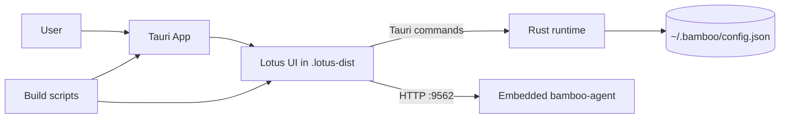

# Bodhi Project Analysis

## Overview
Bodhi is a Tauri desktop shell for Lotus. The repo intentionally owns desktop/runtime concerns only: native commands, app lifecycle, packaging, configuration, and release behavior. Frontend source of truth lives in the sibling Lotus repo or the published `@bigduu/lotus` package.

## Stack
- **Desktop shell**: Tauri v2 + Rust 2021
- **Runtime**: Tokio, Serde, Reqwest, Tauri plugins
- **Backend dependency**: `bamboo-agent` from sibling workspace path
- **Build/runtime scripts**: Node.js/CJS helpers
- **Tests/CI**: Cargo tests, GitHub Actions matrix builds, Lotus E2E delegation

## Main Entry Points
- `src-tauri/src/main.rs:4` → async Tauri bootstrap
- `src-tauri/src/lib.rs:15` → app setup, commands, shortcuts, window events
- `src-tauri/src/embedded/mod.rs:16` → embedded bamboo-agent service lifecycle
- `scripts/lotus-dist.cjs:1` → resolves Lotus source and stages `.lotus-dist`
- `scripts/tauri-mode.cjs:1` → selects internal/public build mode
- `e2e-backend/src/main.rs:1` → standalone backend runner for testing

## Architecture

## Runtime Data Flow
1. App launches via Tauri.
2. `src-tauri/src/lib.rs` sets up logging, shortcut, config, and embedded backend.
3. Lotus UI loads from `.lotus-dist` (or dev server in local mode).
4. Frontend calls Tauri commands for clipboard, proxy config, theme, and setup reset.
5. Frontend/backend also talk to embedded bamboo-agent on port `9562`.
6. Config is persisted under the Bamboo data dir.

## Strengths
- Clear separation: **Lotus = UI**, **Bodhi = shell**, **Bamboo = backend**.
- Supports both local Lotus checkout and packaged Lotus distribution.
- Embedded backend starts automatically with health checks.
- Encrypted proxy-auth persistence; no plaintext auth storage.
- Good platform coverage in CI (Linux/macOS/Windows).
- Helpful dev diagnostics: internal-build confirmation, devtools toggle, webview diagnostics.

## Risks / Gaps
- Strong coupling to sibling repos (`../lotus`, `../bamboo`) can make local setup fragile.
- `src-tauri/src/command/mod.rs` is empty and the repo currently exposes only a small command surface, so some docs may be stale.
- Tauri CSP is fairly permissive (`unsafe-inline`, broad `connect-src`); acceptable for desktop, but worth reviewing.
- Embedded service uses a fixed port (`9562`), so port conflicts or stale processes could affect startup.
- Linux clipboard command falls back to an error, so frontend handling must be robust.

## Next Steps
1. Sync or prune docs to match the current command/API surface.
2. Externalize embedded port/config if multi-instance support matters.
3. Tighten CSP where possible.
4. Add startup/integration tests for local vs package Lotus resolution.
5. Consider a small status command for backend health and mode visibility.

## Key File References
- `README.md:3`
- `src-tauri/src/lib.rs:232`
- `src-tauri/src/lib.rs:444`
- `src-tauri/tauri.conf.json:6`
- `scripts/lotus-dist.cjs:142`
- `scripts/tauri-mode.cjs:37`
- `src-tauri/src/embedded/mod.rs:21`
